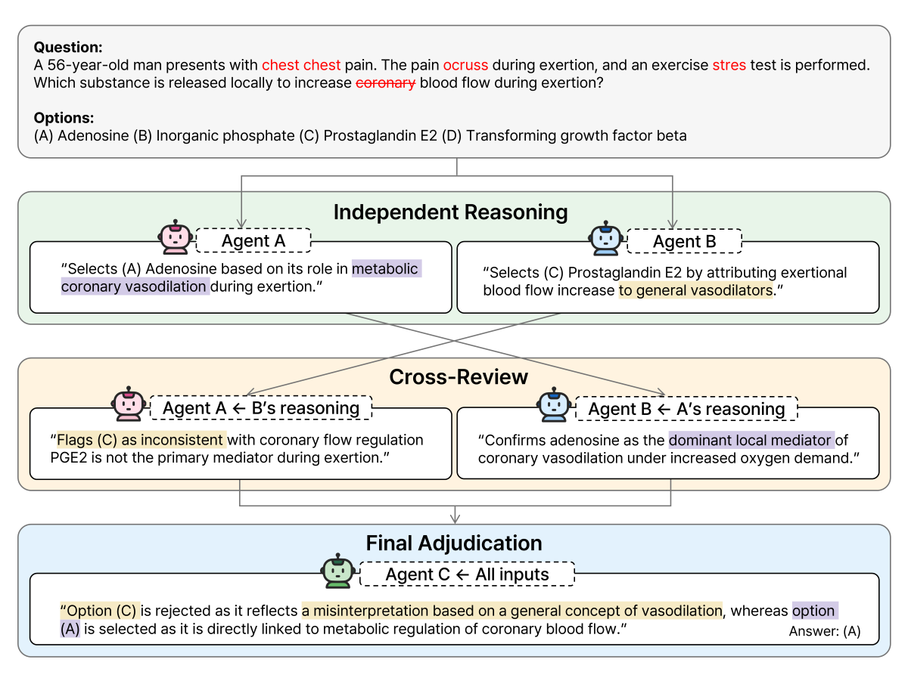

# Multi-Agent Cross-Review of Large Language Models for Medical Question Answering Under Noisy Clinical Text

> **Development and Evaluation Study**

<p align="center">
  
</p>

<p align="center"><em>
Figure 1. Overview of the Medical Multi-agent Cross-Review (MedMCR) framework.
Two reasoning agents produce independent rationales, cross-review each other, and an
adjudicator selects the final answer under noisy clinical text.
</em></p>

---

## Abstract

**Background.** Clinical text in electronic health records frequently contains
heterogeneous noise, such as typographical errors, speech-recognition and optical
character recognition (OCR) errors, and copy-paste duplication, that can degrade the
reliability of AI-driven clinical decision support. Existing approaches target single
noise types or require costly retraining and prior knowledge of the noise.

**Objective.** We aimed to develop a multi-agent framework that provides robustness to
multiple noise types at inference time, without model retraining.

**Methods.** We propose Medical Multi-agent Cross-Review (MedMCR), in which two reasoning
agents generate independent rationales, cross-review each other, and an adjudicator
selects the final answer. We used Qwen2.5-32B-Instruct and gemma-3-27b-it as the reasoning
agents and gpt-oss-20B as the adjudicator. On MedQA, MedMCR was compared with zero-shot and
chain-of-thought (CoT) baselines under six noise types — typographical errors, word
deletion, word duplication, OCR errors, shuffling, and word substitution — at four word
error rate (WER) levels. A linear probability model with a WER-by-method interaction
assessed robustness.

**Results.** MedMCR consistently outperformed the zero-shot and CoT baselines, improving
accuracy from 66.1% to 77.1% under clean conditions (*P* < .001, McNemar test), with gains
sustained across all six noise types. Using only 32B-class models, MedMCR matched
Qwen2.5-72B CoT within 1.4 percentage points. Interaction analysis showed significantly
more gradual degradation for typographical, OCR, shuffling, and duplication noise, whereas
MedMCR degraded more steeply than the baseline under word substitution. Cross-review scores
were positively associated with response accuracy, supporting their validity as a quality
signal.

**Conclusions.** MedMCR enhances inference-time robustness to multiple noise types without
retraining, and the vulnerability of large language models differs across noise types.
Multi-agent cross-review is therefore a promising strategy for improving clinical AI
reliability in noisy real-world environments.

---

## Repository structure

```
Multi-LLM-Agent/
├── prompts/v1/                 # Prompt templates
│   ├── medical_reasoner.txt            # Reasoning agents (A, B)
│   ├── critical_medical_reviewer.txt   # Cross-review
│   ├── final_medical_adjudicator.txt   # Final adjudication
│   ├── baseline.txt                    # Zero-shot baseline
│   └── cot.txt                         # Chain-of-thought baseline
├── src/
│   ├── noise/                  # Noise injection (six types)
│   │   ├── typo.py                     # Typographical errors
│   │   ├── deletion.py                 # Word deletion
│   │   ├── duplication.py              # Word duplication
│   │   ├── ocr.py                      # OCR errors
│   │   ├── shuffle.py                  # Word shuffling
│   │   └── substitution.py             # MLM-based word substitution (PubMedBERT)
│   ├── model/
│   │   ├── baseline/
│   │   │   ├── 0shot.py                # Zero-shot baseline
│   │   │   └── cot.py                  # Chain-of-thought baseline
│   │   └── proposed/
│   │       └── run_pipeline.py         # MedMCR pipeline (stage 1 + stage 2)
│   └── result/                 # Analysis and figures
│       ├── statistical_analysis_all.py # McNemar, LPM interaction, bootstrap CIs
│       ├── result.py / analysis.py     # Result aggregation
│       └── figure/                     # Figure generation scripts
└── pyproject.toml
```

*Data (`data/`) and generated outputs (`results/`) are not tracked.*